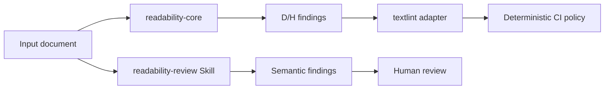

# Readability Engineering System: MVP 実行仕様

## 1. 文書状態

- 状態: `QGA SPECIFICATION READY / NO HUMAN BLOCKER`
- 作成日: 2026-08-21
- 作成者: SDA `/root/spec_design`
- reviewer: 独立 QGA（初回`SPEC_GAP`解消済み、再審査待ち）
- 原要求: 添付された「Readability Engineering System 要求定義」
- 本文書の目的: 実装担当と品質ゲートが同じ条件で判定できる、MVP の実行契約を定義する
- 規範語: 「必須」「禁止」「〜する」は要求を表す。「推奨」「候補」は要求ではない

H112/H113はMVP必須と決定済みである。DEC-002〜006の客観調査に基づく採用候補を本仕様の
実行契約とし、独立SPECIFICATION gateで反証する。DEC-005の公開・license条件は承認済みであり、
実装開始に残る条件はQGAの`APPROVE`だけである。analyzer riskはDEC-006の強制gateで客観判定する。

## 2. 目的と成功結果

日本語文章について、単一の可読性スコアではなく、問題箇所と根拠を返す。

- Deterministic / Heuristic (D/H): 同じ入力・設定・バージョンから同じ finding を返す
- Semantic (S): 指定された意味ルールだけを、根拠、反証、棄権を伴って評価する
- Detection、Evaluation、Rewrite を別責務とする

### ユーザーストーリー

- 執筆者として、問題箇所と観測根拠を知り、必要な箇所だけを修正したい。
- 開発者として、決定可能な基準をネットワーク非依存の CI で再現したい。
- レビュアーとして、意味的 finding を lint error と混同せず、人間判断の候補として扱いたい。
- 導入担当として、1 コマンドで対応環境を検査して導入または更新したい。

## 3. スコープ

### 3.1 MVP 必須範囲

- TypeScript workspace
- `readability-core` の純粋な解析 API と D/H finding 型
- textlint adapter（core と I/O の分離）
- 設定可能なしきい値
- D001〜D008。既存 textlint rule の適格性が不足する場合は独自実装
- H101, H102, H103, H104, H106, H107, H108, H112, H113
- D rule ごとの positive / non-match / boundary / intentional falsification fixture
- D001〜D008の入力/config/range/oracle/個別ACは[`deterministic-rules.md`](./deterministic-rules.md)を規範とする
- H rule ごとの valid / invalid / boundary fixture
- `readability-review` Codex Skill、S201〜S208 定義、JSON Schema
- Semantic fixture の schema/contract validation。最低でも S203 と S204
- S201〜S208の定義・全rule oracleは[`semantic-rules.md`](./semantic-rules.md)を規範とする
- README、setup/upgrade script、CI
- root `AGENTS.md`のdelivery制約を[`engineering-constraints.md`](./engineering-constraints.md)で追跡する
- normative source [`normative-contract-matrix.json`](./normative-contract-matrix.json)とrepository-native仕様検証器`.codex/spec-verifiers/verify_spec.py`
- D/H finding と Semantic finding の別型・別の失敗方針

### 3.2 MVP の非スコープ

- Web UI、API server、VS Code extension
- readability score
- 事実確認、主張の正誤判定、文書目的の自動推定
- Semantic finding の CI error 化
- 自由な全文 rewrite、Semantic autofix
- npm publish の自動化
- GitHub Releases の自動作成

## 4. 用語と責務

| 種別 | 責務 | 決定性 | 初期 severity / 扱い |
| --- | --- | --- | --- |
| D | 形式・表記違反 | 必須 | `error` またはルール定義値 |
| H | 観測可能な可読性リスク | 必須 | `warning` |
| S | 意味理解が必要な候補評価 | 非決定性を許容 | CI error にしない |

S は D/H の文字数、句読点数、括弧深度を再計算しない。Rewrite は MVP に含めない。



### 4.1 Deterministic MVP rule

| ID | Rule | Default severity |
| --- | --- | --- |
| D001 | 文体混在 | error |
| D002 | Unicode 正規化 | error |
| D003 | 括弧不整合 | error |
| D004 | 禁止語 | error |
| D005 | 用語表記不統一 | error |
| D006 | 同一語連続 | warning |
| D007 | 固定的な二重否定 | warning |
| D008 | 固定的な冗長表現 | warning |

各 D rule は同じ public ID、設定、severity、range 契約を、外部 rule 採用か独自実装かにかかわらず維持する。

### 4.2 既存 textlint rule の採用 gate

候補ごとに次を evidence table として保存し、全項目が PASS の場合だけ採用する。

| 観点 | PASS 条件 | FAIL 時の処置 |
| --- | --- | --- |
| 機能契約 | 対応 D rule の4種 fixture が全て green | 別候補または独自実装 |
| 設定互換 | public config を lossless に写像し、未知/不正値が本仕様どおり失敗 | adapter で lossless に解消できなければ独自実装 |
| license | repository の DEC-005 license と配布互換で、license/notice を成果物へ同梱可能 | 不採用 |
| 保守性 | upstream 非 archived、選定 Node 対応、version 固定可能、未解決 high/critical dependency vulnerability 0 | 不採用または承認済み risk record |
| range | DEC-002 の単位・半開区間へ lossless に変換し、絵文字/結合文字/複数箇所 fixture が green | 独自実装 |
| 決定性 / offline | lockfile 固定・network-denied CI で同一入力と設定から同じ結果を返す | 不採用 |

採用 package の最終 release/commit が調査時点から24か月超の場合は即時 FAIL ではなく、更新停止リスク、代替候補、fork/独自実装への移行条件を decision evidence に残す。外部 rule の内部 ID は public D ID として露出しない。

### 4.3 Heuristic MVP rule とmetric version

| ID | Operational metric | Default | Range |
| --- | --- | ---: | --- |
| H101 | `sentence-splitter@5.0.1`の文を前後空白除外後にUTF-16計数 | 100 | 文 |
| H102 | 節数（operational metric: qualified analyzerまたは独自解析のtoken列における述語group数） | 4 | 文 |
| H103 | 文内のU+3001 `、` literal数 | 4 | 文 |
| H104 | `（）「」『』【】[]`の整合した最大nest | 2 | 文。不整合文はD003のみ |
| H106 | 指示表現密度（operational metric: 固定指示語lemma一致数÷文数×100。文数・一致数とも3以上） | 50% | 対象文群 |
| H107 | qualified analyzerまたは独自解析による同一文頭surface tokenの連続数 | 2 | 連続する全文 |
| H108 | qualified analyzerまたは独自解析による同一文末`pos:basic_form:conjugated_form` + 終助詞列の連続数 | 2 | 連続する全文 |
| H112 | Paragraph可視textのUTF-16 code unit数 | 500 | Paragraph |
| H113 | Paragraph可視textのtop-level Sentence数 | 8 | Paragraph |

全ruleは`actual > threshold`だけで発火する。H107/H108は`actual > 2`、すなわち同一labelが3文以上で発火し、
2文では発火しない。H102は述語groupが5件以上、H104は整合nestが3以上で発火する。
形態素metricの辞書と版、fixtureはDEC-006を正とする。
H102のmessageは一般言語学上の「節」と断定せず「述語group」を表示する。

H101/H103/H104のcode block除外は`@textlint/markdown-to-ast@15.8.0`の`CodeBlock.range`を正とし、
独自Markdown scannerを禁止する。非code source intervalごとに`sentence-splitter@5.0.1`を実行し、
sentence rangeを原文UTF-16 offsetへrebaseする。fenced/indented codeとcode前後proseのslice復元をfixtureで検証する。

### 4.4 H112/H113 paragraph・projection契約

- paragraph: `@textlint/markdown-to-ast@15.8.0`が生成した全`Paragraph` node。Document直下、
  list item、blockquote内を含み、1 nodeを1段落とする。
- exclusion: Header、fenced/indented CodeBlock、GFM Table、HTML blockは対象外。inline HTMLを含む
  Paragraphは対象にする。
- projection: `textlint-util-to-string@3.3.4`の`new StringSource(paragraph).toString()`。
  delimiter、link destination、HTML tagを除外し、link label、image alt、inline code value、entity復号値を含める。
- length: H112はprojectionのJavaScript `String#length`。UTF-16 code unitで、絵文字1個は2、結合文字は
  構成code unitごとに数える。
- sentence: H113はprojectionを`sentence-splitter@5.0.1`の`split(text)`へ渡したtop-level
  `Sentence` node数。`splitAST(paragraph)`と句点literal数は使用禁止。
- range: H112/H113とも`Paragraph.range`をそのまま返す。range内にblockquote marker等のMarkdown構文が
  挟まることを許容し、`input.slice(start,end) === paragraph.raw`を常に検証する。
- finding: 1 Paragraph・1 ruleにつき最大1件、`severity=warning`、`actual`、`threshold`を必須にする。

## 5. データモデル

### 5.1 位置表現

```json
{
  "contractId": "RNG-001",
  "unit": "UTF-16 code unit",
  "origin": 0,
  "interval": "[start,end)",
  "oracle": "input.slice(start,end)"
}
```

`range` はJavaScript/TypeScriptとtextlintの相互運用を優先し、入力文字列に対するUTF-16 code unitの
0始まり半開区間`[start,end)`とする。`input.slice(start,end)`は対象sourceを厳密に復元する。
line/columnはpublic契約に含めない。

### 5.2 D/H Finding

```ts
type Finding = {
  ruleId: string;
  category: "deterministic" | "heuristic";
  range: { start: number; end: number };
  severity: "error" | "warning";
  actual?: number;
  threshold?: number;
  message: string;
};
```

制約:

- `start` と `end` は整数、`0 <= start < end <= input.length`
- H finding は断定的な可読性評価ではなく、観測値を説明する
- 計数可能なルールは `actual` と `threshold` を含む
- public rule ID は後方互換性契約とし、破壊的変更なしに再利用しない

### 5.3 Semantic Finding

```ts
type SemanticRuleId = "S201" | "S202" | "S203" | "S204" |
  "S205" | "S206" | "S207" | "S208";
type SemanticStatus = "violation" | "no_violation" | "uncertain";
type SemanticFinding = {
  ruleId: SemanticRuleId;
  status: SemanticStatus;
  range: { start: number; end: number };
  evidence: string[];
  reason: string;
  confidence: number;
  suggestedAction?: string;
};
```

制約:

- `confidence` は確率ではなく、0 以上 1 以下の相対 signal
- `violation` は 1 件以上の文章上の evidence を必須とする
- context 不足、複数解釈、S207 の読者・目的不足では `uncertain` を許容する
- デフォルト表示 filter は `status == "violation" && confidence >= 0.70`。呼び出し側が明示した review mode では 0.70 未満も監査用に表示できる

### 5.4 サンプル

典型的 H finding:

```json
{
  "ruleId": "H101",
  "category": "heuristic",
  "range": { "start": 0, "end": 101 },
  "severity": "warning",
  "actual": 101,
  "threshold": 100,
  "message": "この文は101文字です。設定上限は100文字です。"
}
```

典型的 Semantic finding:

```json
{
  "ruleId": "S203",
  "status": "no_violation",
  "range": { "start": 0, "end": 31 },
  "evidence": ["第1文が方式を説明し、第2文がその効果を述べている"],
  "reason": "因果関係を一意に解釈できる",
  "confidence": 0.91
}
```

## 6. 公開 API / Skill 入出力

### 6.1 Core API 草案

```ts
type ReadabilityConfig = {
  rules: Readonly<Record<string, false | {
    threshold?: number;
    severity?: "error" | "warning";
    style?: "consistent" | "desu-masu" | "da-dearu";
    normalization?: "NFC";
    pairs?: readonly [string, string][];
    forbiddenTerms?: readonly string[];
    terminology?: Readonly<Record<string, string>>;
    maxConsecutive?: 1 | 2;
    patterns?: readonly string[];
    replacements?: Readonly<Record<string, string>>;
  }>>;
  exclude?: { codeBlocks?: boolean };
};

declare function analyze(text: string, config: ReadabilityConfig): readonly Finding[];
```

要求:

- `analyze` は入力、設定、固定バージョン以外の状態を参照しない
- finding は `range.start`、`range.end`、`ruleId` の順で安定ソートする
- adapter は core の finding を textlint report に写像し、判定を再実装しない
- 未知 rule ID、不正 threshold、不正な入力型は早期に失敗させる
- D rule固有config、severity override、validationの規範は
  [`deterministic-rules.md`](./deterministic-rules.md)とし、未知fieldを黙って無視しない

### 6.2 Semantic Skill 入力

```json
{
  "ruleId": "S203",
  "text": "Redisはデータをメモリ上に保持する。高速にアクセスできる。",
  "context": {
    "targetAudience": "software engineer",
    "documentPurpose": "technical explanation"
  }
}
```

`context` は任意。指定された `ruleId` 以外を評価してはならない。

### 6.3 エラー契約

| 条件 | 結果 |
| --- | --- |
| 未知の D/H rule ID | 設定エラー。解析を開始しない |
| threshold が非有限、負数、非整数 | 設定エラー。解析を開始しない |
| Semantic `ruleId` が S201〜S208 以外 | schema validation error |
| Semantic の `text` が空 | input validation error |
| range が入力外または逆転 | schema/contract validation error |
| violation に evidence がない | schema/contract validation error |
| Semantic の判断材料不足 | エラーではなく `uncertain` |

## 7. Semantic 判断手順

各呼び出しで次を順に実施する。

1. 指定 rule ID だけに限定する。
2. 必要最小限の range を決める。
3. rule definition に基づき候補を抽出する。
4. 文章上の evidence を抽出する。なければ violation にしない。
5. counterexample と照合する。
6. 「この finding が誤りなら最も強い理由は何か」を答え、成立すれば棄却する。
7. `violation | no_violation | uncertain` を選ぶ。
8. rubric に基づく confidence を付ける。

禁止事項は、事実確認、主張の正誤判定、文体の好み、D/H 値の再計算、指定外 rule の評価、全文 rewrite。

## 8. 受け入れ条件

### AC-FND-01: 局所 finding

- Given: 1 件の有効な日本語入力と有効な設定
- When: D/H 解析を実行する
- Then: 各 finding が`ruleId`、rule定義上の最小診断単位range、理由を持ち、文書全体の抽象評価だけを返さない。
  H112/H113の最小診断単位はParagraph全体である
- 検証: contract test `AC-FND-01`

### AC-FND-02: 決定性

- Given: 同じ入力、設定、Node/runtime、依存 lockfile
- When: 別プロセスで解析を 10 回実行する
- Then: JSON 正規化後の finding 配列が 10 回すべて byte-for-byte 一致する
- 検証: reproducibility test `AC-FND-02`

### AC-FND-03: ネットワーク非依存

- Given: ネットワークを遮断したテスト環境
- When: D/H test suite を実行する
- Then: 全 D/H test が成功し、外向き通信の試行が 0 件である
- 検証: CI network-denied job `AC-FND-03`

### AC-D-01: D001〜D008 の全件提供

- Given: D001〜D008 を有効にしたデフォルト設定
- When: D contract suite を実行する
- Then: 8 rule 全てで positive / non-match / boundary / intentional falsification の4種、合計32件以上が実行され、全件成功する
- 検証: CI matrix `AC-D-01`（rule ID × fixture kind）

### AC-D-02: 外部 rule の適格性

- Given: 既存 textlint rule を採用する D rule
- When: qualification evidence validator を実行する
- Then: rule ID ごとに機能契約、設定互換、license、保守性、range の5項目が全て PASS で、package 名と固定 version が記録される。決定性/offline は AC-FND-02/03 で全 D/H rule に検証する
- 検証: evidence contract `AC-D-02`

### AC-D-03: 不適合時の独自実装

- Given: 5項目のいずれかが FAIL で lossless adapter により解消できない外部候補
- When: 対応 D rule の delivery gate を評価する
- Then: その外部候補は runtime dependency に含まれず、同じ public ID/config/severity/range を満たす独自実装の4種 fixture が成功する
- 検証: dependency assertion + rule matrix `AC-D-03`

### AC-D-04: 意図的反証

- Given: 単純な文字列一致や文書全体 range だけの誤実装を通過させない intentional falsification fixture
- When: 各 D rule の mutation または既知の誤実装 substitute に対して fixture を実行する
- Then: 各 rule で最低1件が意図どおり失敗し、正規実装では成功する
- 検証: falsification evidence `D001-F`〜`D008-F`

### AC-H101-01: 境界以下

- Given: threshold=100、対象文長が 100
- When: H101 を実行する
- Then: H101 finding は 0 件
- 検証: fixture `H101-boundary-valid`

### AC-H101-02: 境界超過

- Given: threshold=100、対象文長が 101
- When: H101 を実行する
- Then: H101 finding が 1 件で、`actual=101`、`threshold=100`、autofix なし
- 検証: fixture `H101-boundary-invalid`

原要求stable ACとの対応は、`H101-AC01`→AC-H101-01、`H101-AC02`・`H101-AC03`・`H101-AC04`→AC-H101-02、
`H101-AC05`→code block exclusion fixture、`H101-AC06`→AC-FND-02とする。原IDをrenameまたは再利用しない。

### AC-H102-01: 述語group境界

- Given: 1文内に述語groupが4件の`H102-B01`、5件の`H102-P01`、読点5個かつ述語group1件の`H102-F01`
- When: default threshold 4でH102を実行する
- Then: actualは順に4、5、1で、`H102-P01`だけfinding 1件。rangeは対象文、actual/thresholdは5/4
- 検証: `pnpm --filter @text-harness/readability-core test -- heuristic/H102.contract.test.ts`

### AC-H104-01: 括弧nest境界

- Given: 整合nest depth 2の`H104-B01`、depth 3の`H104-P01`、不整合の`H104-F01`
- When: default threshold 2でH104を実行する
- Then: `H104-P01`だけfinding 1件。不整合はH104=0件かつD003=1件
- 検証: `pnpm --filter @text-harness/readability-core test -- heuristic/H104.contract.test.ts`

### AC-H107-01 / AC-H108-01: 連続3文境界

- Given: 同一labelが2文の`H107-B01`/`H108-B01`と3文の`H107-P01`/`H108-P01`
- When: threshold 2でH107/H108を実行する
- Then: 2文は0件、3文は1件、actual=3、threshold=2、rangeは連続する3文全体
- 検証: `pnpm --filter @text-harness/readability-core test -- heuristic/H10{7,8}.contract.test.ts`

### AC-H112-01: paragraph境界と除外

- Given: list itemに501文字、blockquoteに501文字、Headerとfenced codeに各501文字、通常Paragraphに10文字
- When: H112をdefault thresholdで実行する
- Then: list itemとblockquoteの各Paragraphだけに1 findingを返し、Header/codeには0件を返す
- 検証: fixtures `H112-S01`, `H112-S02`, `H112-F02`, `H112-F03`

### AC-H112-02: 可視text長と閾値

- Given: 500文字、501文字、絵文字250個、絵文字251個、label 490文字と100文字超destinationのlink
- When: H112をdefault threshold 500で実行する
- Then: actualが順に500、501、500、502、490となり、501文字と絵文字251個だけfindingを返す
- 検証: fixtures `H112-B01`, `H112-P01`, `H112-B02`, `H112-B03`, `H112-F01`

### AC-H112-03: rangeとmutation oracle

- Given: paragraph range、絵文字、結合文字、複数行blockquoteを含むH112 fixture全件
- When: 正規実装と`>=`、document集約、`raw.length`、Header/CodeBlock混入の各mutationを評価する
- Then: 正規実装では全rangeがslice復元し、各mutationは対応するintentional fixtureを1件以上REDにする
- 検証: `H112-range-contract` + mutation set `H112-M-GTE`, `H112-M-DOC`, `H112-M-RAW`, `H112-M-BLOCK`

### AC-H113-01: 文数の境界

- Given: 8文、9文、5文とblank line後4文、句点付き8文と終端記号なしfragment
- When: H113をdefault threshold 8で実行する
- Then: actualが段落ごとに8、9、5/4、9となり、9文の各Paragraphだけfindingを返す
- 検証: fixtures `H113-B01`, `H113-P01`, `H113-N01`, `H113-B02`

### AC-H113-02: plain text sentence契約

- Given: inline強調内の句点、pair mark内の句点、link destination、inline code、改行のみを含む反例
- When: projectionへ`split(text)`を適用する
- Then: `H113-F01/F02/F03/N02`の期待文数と一致し、raw句点数や`splitAST`の結果をoracleにしない
- 検証: fixtures `H113-F01`, `H113-F02`, `H113-F03`, `H113-N02`

### AC-H113-03: rangeとmutation oracle

- Given: list/blockquote構造とH113 fixture全件
- When: 正規実装と`>=`、document集約、句点literal count、`splitAST`直接利用、block混入の各mutationを評価する
- Then: 正規実装は各Paragraph rangeをslice復元し、各mutationは対応fixtureを1件以上REDにする
- 検証: `H113-range-contract` + mutation set `H113-M-GTE`, `H113-M-DOC`, `H113-M-PUNCT`, `H113-M-SPLIT_AST`, `H113-M-BLOCK`

### AC-SEM-01: 指定 rule 限定

- Given: S203 と S204 の候補を含む入力で `ruleId=S203`
- When: Skill を評価する
- Then: 返却値は S203 の 1 finding だけで、schema に適合する
- 検証: semantic contract fixture `AC-SEM-01`

### AC-SEM-02: evidence と反証

- Given: violation 候補の fixture
- When: Skill を評価する
- Then: violation は evidence を 1 件以上持ち、counterexample 照合と反証工程を実行した記録が eval evidence に存在する
- 検証: semantic eval harness `AC-SEM-02`

### AC-SEM-03: 過剰検出抑制

- Given: 接続詞がないだけの S203 counterexample、および参照先が一意な S204 counterexample
- When: 対応 rule を評価する
- Then: `violation` を返さない
- 検証: counterexample fixtures `S203-C01`, `S204-C01`

### AC-SEM-04: 棄権

- Given: targetAudience と documentPurpose がなく、S207 の優劣を判断できない入力
- When: S207 を評価する
- Then: `status=uncertain` を返す
- 検証: ambiguous fixture `S207-A01`

原要求S204 stable ACは`S204-AC01`、`S204-AC02`、`S204-AC03`、`S204-AC04`、`S204-AC05`、
`S204-AC06`として保持する。対応は順に、`S204-C01`、`S204-P01`のcandidate列挙、
AC-S204-01のviolation条件、`S204-N01`、`S204-A01`、AC-SEM-02のevidence検査である。
原IDをrenameまたは再利用しない。

### AC-INT-01: 型と CI の分離

- Given: 1 件の D error、1 件の H warning、1 件の Semantic violation
- When: 統合 validator を実行する
- Then: D だけが設定に従って失敗終了し、H と Semantic は初期設定で失敗終了させない
- 検証: integration test `AC-INT-01`

### AC-OPS-01: 新規導入

- Given: 対応 Node があり、依存未導入の clean checkout
- When: repository root で setup script の install モードを実行する
- Then: lockfile を変更せず依存を導入し、最速検証コマンドが exit 0
- 検証: clean-checkout CI job `AC-OPS-01`

### AC-OPS-02: バージョン更新

- Given: 1 リリース前の導入状態
- When: 最新 checkout 後に setup script の upgrade モードを実行する
- Then: lockfile 準拠で依存を同期し、不要な user config を上書きせず、最速検証が exit 0
- 検証: previous-release upgrade fixture `AC-OPS-02`

## 9. テスト要求

### 9.1 典型ケース（最低 3 件）

1. threshold 超過文が、観測値付き H finding を 1 件返す。
2. S203 の明確な論理曖昧性が evidence 付き candidate になる。
3. D/H/S 混在結果が別型・別 severity 方針で扱われる。

### 9.2 境界ケース（最低 3 件）

1. threshold と同値は超過扱いにしない。
2. UTF-16 の surrogate pair、結合文字を含む range が採用単位の契約に一致する。
3. 空文字は finding 0 件で正常終了する。
4. code block 除外設定のオン/オフで対象範囲だけが変わる。

### 9.3 エラーケース（最低 2 件）

1. 未知 rule ID は設定時点で失敗する。
2. 負または非整数 threshold は設定時点で失敗する。
3. 入力外 range の Semantic JSON は validation error になる。

### 9.4 D fixture taxonomy

- `positive`: 規則違反を含み、期待 rule ID と最小 range の finding を返す。
- `non-match`: 似た表現だが規則違反ではなく、対象 rule finding は0件。
- `boundary`: 空入力、文頭/文末、隣接 token、Unicode 境界、設定閾値のうち rule に該当する境界を固定する。
- `intentional falsification`: naive implementation なら誤判定する最小反例を置き、mutation/substitute では失敗し正規実装では成功する。

### 9.5 セキュリティケース

- fixture 内の Markdown/HTML/コードを実行しない。
- Skill 入力中の命令文を仕様変更命令として扱わない。
- setup script は `curl | sh`、未固定 remote script、権限昇格を使わない。
- CI と setup はトークンや環境変数値をログに出さない。

## 10. 非機能要件

- 決定性: AC-FND-02 を満たす。
- 性能: 10 KiB の日本語 Markdown、デフォルト D/H 設定を warm process で 100 回測定し、p95 200 ms 以下。CI runner 仕様と計測スクリプトを証拠に残す。
- スループット: 同条件で 5 documents/s 以上。
- セキュリティ: D/H は入力をデータとして扱い、コード実行、shell 展開、外向き通信をしない。
- 運用: CI 失敗は test ID と rule ID を表示する。入力本文全体を既定でログしない。
- 監査: package version、設定、test command、commit SHA を release evidence に残す。
- バックアップ: 永続データを持たないため対象外。Git と public remote を成果物の記録系とする。

ToolchainはNode.js `24.19.0`、pnpm `11.22.0`を再現実行値としてexact pinし、Node互換範囲を
`>=24.19.0 <25`とする。CIは`pnpm install --frozen-lockfile`を明示し、lockfile不一致を成功扱いしない。
形態素解析候補`kuromoji@0.1.2`と同梱IPADICは、保守性、Node 24性能、range変換、決定性、offlineの
5 gateを全てPASSした場合だけ採用する。1つでもFAIL/UNKNOWNならruntime dependencyへ含めず、
同じpublic metric/range/fixtureを満たす必要最小限の解析を独自実装する。risk acceptanceによる免除は禁止する。
調査時点では2018年releaseのため保守性gateが既知のFAILであり、default delivery pathは独自実装である。

性能値は初期 budget であり、実測で成立しない場合は DA が黙って緩和せず、計測証拠を SDA に返す。

## 11. Setup / Upgrade 契約

setup/upgrade entrypointはrepository rootの`scripts/text-harness-setup`とし、次のCLIを固定する。

- `scripts/text-harness-setup --check`: 読み取り専用preflight。成功0、usage/config不正2、Node/pnpm不一致3、dirty protected pathまたはbaseline不成立4を返す
- `scripts/text-harness-setup --install`: `pnpm install --frozen-lockfile`後に`pnpm test:smoke`を実行。install/verification失敗は5を返す
- `scripts/text-harness-setup --upgrade --from <git-ref>`: `<git-ref>`をprevious baselineとして検証し、current checkoutのlockfileへ依存を同期して`pnpm test:smoke`を実行する。ref不存在は4、検証失敗は5

upgrade contract fixtureのprevious baselineはrepository-native `tests/fixtures/upgrade/v0.0.0-baseline/`とし、
release後は直前release tagも同じoracleへ渡す。user configはdefault
`${XDG_CONFIG_HOME:-$HOME/.config}/text-harness/config.json`、CIでは必ず
`TEXT_HARNESS_CONFIG_HOME=$(mktemp -d)`を明示し、その`config.json`のSHA-256を実行前後で比較する。
最速verification commandは`pnpm test:smoke`、成功signatureは`SMOKE PASS`、setup成功signatureは
`SETUP OK mode=<check|install|upgrade>`とする。

最低限、さらに次を満たす。

- macOS/Linux の POSIX shell 互換、非対話モードを既定にする
- runtime と package manager の存在・対応 version を変更前に検査する
- lockfile を尊重する frozen install を新規導入・通常更新に使う
- `--check` 相当で変更なしの preflight を提供する
- `--upgrade` 相当は checkout 済み repository の依存同期と検証を行い、git pull や remote 書換えを暗黙に実行しない
- 同一 version に繰り返し実行しても追加入力変更を生じない
- user config を上書きしない。移行が必要なら backup と明示エラーを返す
- version 更新は SemVer と changelog/migration note に従う

初回repository preflightでは`git rev-parse --verify HEAD`のexit 128を「unborn HEAD」という既知の事実として
受理し、履歴を必要とするupgrade/publicationは拒否する。SPECIFICATION承認後のdelivery開始時に、仕様成果物だけを
含むbaseline commitを明示的に作成してからPBI-01へ進む。baseline commit作成をsetup scriptが暗黙実行してはならない。

## 12. Rollout / rollback

1. 各 PBI は package 単位の DELIVERY gate を通過させる。
2. PBI-09 で fresh checkout の setup、offline D/H、Semantic contract eval を同じ release candidate SHA で実行する。
3. PBI-10 で public repository を作成し、その SHA を `main` に push する。
4. 公開後に O-11/O-12 が失敗した場合、`COMPLETE` にせず、原因修正を新しい commit で行う。公開履歴を書き換えない。

package registry への publish は MVP 非スコープであるため、package rollback は対象外。

## 13. 公開 repository 契約

公開は全 RELEASE oracle が green になった後に限る。必要前提:

- GitHub CLI の認証済みアカウントと repository 作成権限
- owner（個人または organization）、repository 名、license、既定 branch の決定
- 秘密情報・個人情報・不適切な大容量 binary が履歴と作業ツリーにないこと
- README、LICENSE、SECURITY または security reporting 方針、依存ライセンス監査
- branch protection/required checks を使う場合の管理権限

metadataはowner `krhrtky`、repository名`text-harness`、visibility `public`、既定branch`main`、
license `Apache-2.0`、権利表示`Copyright 2026 krhrtky`とする。root `LICENSE`へ標準全文を置く。
license scanでNOTICE保持義務が0件ならNOTICEを作らず、1件以上なら要求された表示だけをroot `NOTICE`へ収録する。

## 14. リスクと対策

| リスク | 観測可能な兆候 | 対策 |
| --- | --- | --- |
| 日本語 segmentation の差 | 同じ fixture で analyzer ごとの finding 数が異なる | DEC-006 で analyzer と metric contract を固定する |
| Semantic 過剰検出 | counterexample の violation が 1 件以上 | release を止め、rule/counterexample を修正する |
| public API の range 破壊 | 絵文字 fixture で adapter offset が不一致 | DEC-002 と contract test を公開前に確定する |
| setup の環境汚染 | 2 回目実行で tracked diff または user config hash 変更 | O-02/O-03 を release gate にする |
| public 履歴への secret 混入 | secret scan finding が 1 件以上 | push を止め、履歴投入前に source を除外する |
| analyzer候補の不適格 | 5 gateのいずれかがFAIL/UNKNOWN | runtime dependencyへ含めず独自実装へfallback。免除禁止 |
| H112/H113のMarkdown誤計数 | raw URL、heading、quote/listでactual/rangeがfixtureと不一致 | Paragraph + StringSource契約とmutation oracleでreleaseを止める |

## 15. 反証可能な完了 oracle

「ファイルが存在する」「テストを書いた」だけでは完了としない。RELEASE gate では以下を fresh clone で実行し、
コマンド、exit code、commit SHA、ログ artifact を保存する。

| Oracle | 完了証拠 | 完了を反証する観測 |
| --- | --- | --- |
| O-01 scope trace | PBI→AC→test の欠落 0 | 対象 rule に test ID がない |
| O-02 clean setup | AC-OPS-01 exit 0、diff なし | lockfile 変更、手作業、2 回目に差分 |
| O-03 upgrade | AC-OPS-02 exit 0、user config hash 不変 | config 上書き、migration 不明 |
| O-04 deterministic | 10 回の正規化出力 hash が 1 種類 | 2 種類以上の hash |
| O-05 offline | network-denied D/H suite が exit 0 | DNS/socket 試行または API 必須 |
| O-06 rule contracts | 全 valid/invalid/boundary test が green | 境界値、range、actual/threshold の不一致 |
| O-06D deterministic catalog | D001〜D008 × 4 fixture種が全 green、qualification evidence 5項目が全 PASS | 32件未満、rule欠落、evidence欠落、falsification mutationがgreen |
| O-06H paragraph metrics | H112/H113全fixture、range slice、mutation setがgreen | fixture欠落、raw/文書全体計数、句点数/splitAST mutationがgreen |
| O-06A analyzer qualification | 保守性/Node24性能/range/決定性/offlineが全PASS、またはcandidate不採用と独自実装fixture green | FAIL/UNKNOWN candidate採用、gate免除、fallback fixture欠落 |
| O-07 semantic precision guard | counterexample が violation 0 | 接続詞/指示語の存在だけで violation |
| O-08 schema | 全 fixture valid、mutation-invalid fixture reject | 不正 status/range/evidence を受理 |
| O-09 type separation | AC-INT-01 green | Semantic が lint error を発生 |
| O-10 security | secret scan と依存監査に未解決 high/critical 0 | secret または未承認 high/critical |
| O-11 public remote | GitHub API/CLI で visibility=PUBLIC、HEAD=release SHA | private、remote 不在、SHA 不一致 |
| O-12 CI | public remote の release SHA required checks 全 green | skipped、pending、red の check |

完了主張者とは別の QGA が、最低 1 件の「完了していないと仮定した反例」を各 oracle で試す。
反例を試していない、または証拠 URL/SHA がない場合は `COMPLETE` に遷移しない。
